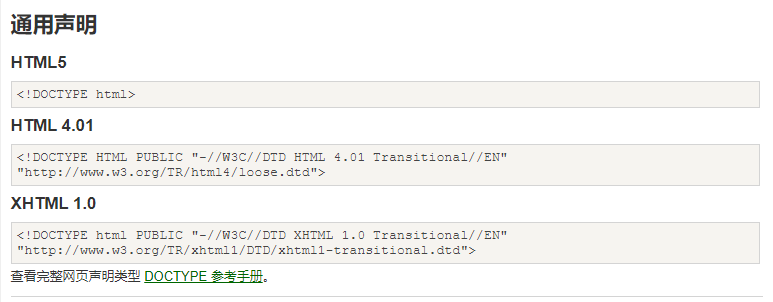
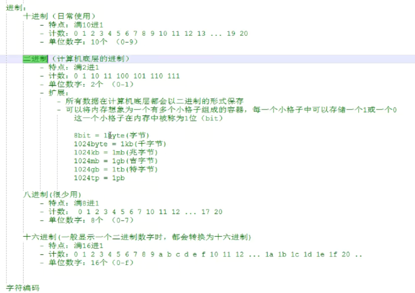

## 网页是自上向下解析

```html
<!DOCTYPE html>声明为html5文档（不区分大小写）
<html lang="en">html页面的根元素（根标签），lang:网站语言
<head>包含文档的元数据（不显示在页面，数据给浏览器）
    <meta charset="UTF-8">设置字符集编码
    <title>Title</title>网页标题
</head>
<body>含页面内的可见内容
</body>
</html>
```




## HTML注释

```
<!-- -->
!!!注释不能嵌套
```

## 进制




